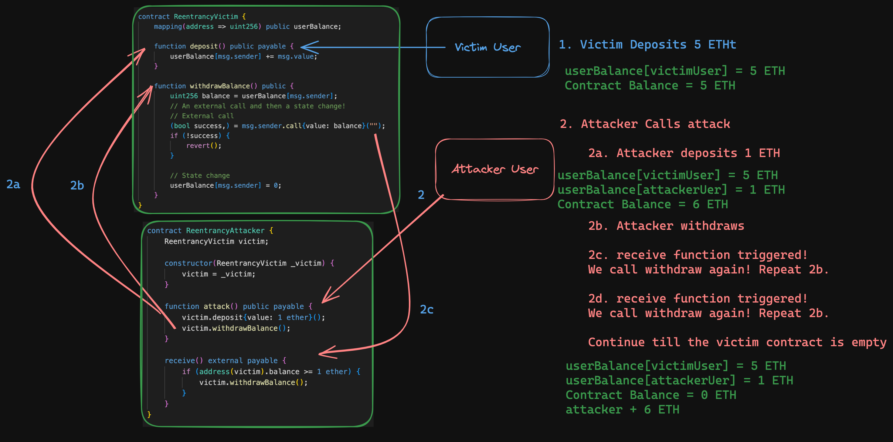

# Cyfrin - Puppy Raffle - Security and Auditing Lesson Notes

## Static Analysis

### Slither

```bash
usage: slither target [flag]

target can be:
        - file.sol // a Solidity file
        - project_directory // a project directory. See https://github.com/crytic/crytic-compile/#crytic-compile for the supported platforms
        - 0x.. // a contract on mainnet
        - NETWORK:0x.. // a contract on a different network. Supported networks: mainet,optim,goerli,sepolia,tobalaba,bsc,testnet.bsc,arbi,testnet.arbi,poly

Can also print the results out in a variety of ays using the `--print` flag and then passing in a printer name (shown in slither --help)

$ slither . --print human-summary

....

$ slither . --print contract-summary


```

slither also has native configuration for Foundry and Hardhat and we can actually just pass a single period `.` as the target and slither is smrat enouhg to figure out the framework we are using.
```
slither .

```

### Aderyin

Aderyin is a Rust based static analysis tool.

After installing everything, you can just run the command `aderyin` and it will print out a report in a folder that it details.

## Cyfrin's - Smart Contract Explotes - Minimised

[Cyfrin's - Smart Contract Exploits - Minimised](https://github.com/Cyfrin/sc-exploits-minimized) is a repository containing minimised examples of common exploits in smart contracts - such as DoS, reeantrancy, etc.

It includes links to various sites where the can be tested, visualised, and even found in CTF challenges.

## Denial of Service - DoS

Denial of Service attacks can be fairly straight forward conceptually, but are quite powerful. There are a few DoS attack types that are used.


### Quick Attacker Mindset Questions for DoS Attack Vectors

- Is there a loop with a non-defined ending index or size? Think of the size as being infinite and ask `can infinite deny the operation of the protocol due to time or cost?`
- What are the upstream or downstream implications (if any) for an, imagined, infinite sized array?
- Is it possible that the smart contract could be trying to send a token to an address that can't recieve it?
- What logic problems arise when the protocl can't complete some neccessecary pieces of logic? 
  - Is there broader denial of service of the protocol?
- What external calls exist in the protocol? 3rd party, transfer of ETH
  - Is there a way for these external calls to fail? 
  - Can attacker malciously revert instantly on recieve or fallback to cause flow on effects?
  - Is there a specified gas limit that can be xploited in external calls from the protocol to cause a revert?
  - If yes, will it casuse the tope level function to revert entirely? 
  - How doe sthis affect the system?


### Attack vectors

#### Ethereum Block Gas Limit

Ethereum block sizes are limited by setting block gas fee limits. An Ethereum block has a target size of 15 million gas and a `maximum limit of 30 million gas`

#### Gas costings DoS attack
An attacker may find a contract desinged for a lottery, DeFi protocol or some sort of financial reward and blow up the size of an array that is looped over to deny any other people interacting with this array because of the costs associated with it. Potentially exceeding the block gas limit.

We can often see DoS attacks in cases where there is looping over arrays. This scenario normally raises some eyebrows at potential gas costs, and it is corerct that this can be more gas expensive - and in fact, this is what begins to feed into the issue.

Here is a snippet of a loop from the sc-exploits-minimized repository:

```solidity

address[] entrants;


//@note this function checks to see if the msg.sender already exists in the entrants array
function enter() public {
        // Check for duplicate entrants
        for (uint256 i; i < entrants.length; i++) {
            if (entrants[i] == msg.sender) {
                revert("You've already entered!");
            }
        }
        entrants.push(msg.sender);
    }
```

In this function, we will loop through the address array `entrants` to see if the msg.sender address already exists in the array.

As the size of this array continues to grow in size, the computation cost - as well as gas costs - begin to rise. 

An easy way to think about this is if the array had 1000 addresses, to verify the msg.sender address doesn't exist in the array from 0 to 999, it would take way more gas before being pushed into the array. However, the 3rd address only has to loop 3 times and therefore the gas cost is way lower. Now imagine there is 10,000 addresses in the array!

We have created a situation where there is a possibility that this function of the protocol becomes unusable because of the gas cost to complete the checks! Essentially denying the service of the contract.

#### Denial of Smart Contract Logic DoS attack by an attacker not having expected logic to handle certain transactions

We can see this attack begin to arise when we are dealing with a protocol that attempts to carry out straigth forward logic processing but have not accounted for the contract address that is interacting with it to be misconfigured in a way that can affect other core logic functions of the protocol.

For example, if the part of a lottery or auction system picks a winner, or handles highest new highest bidder and is holding on to tokens, and attempts to transfer a token/s to required address - such as winner, or former highest bidder but that address causes a revert. We may deny the service of the rest of the protocol because the spefific fucntions is required to be completed before it can execute normal operations.

### Proof of Concept

You can write tests, using a framework like Foundry, that interacts with functions that loop over arrays and for each transaction we can capture the gas costs for each transaction and carry out an assertion that for each new item added to the array results in higher gas fees.

The sc-exploits-minimized repository contains some Foundry tests demonstrating this exact PoC.

### DoS Case Study with Owen Thurm of Guardian Audits

#### Case Study 1 - DoS Dividends from Bridges Exchage audit completed by Guardian Audits - possible to exceed block gas limit

https://github.com/GuardianAudits/Audits/tree/main/Bridges

The protocol used an unbounded array to maintain a list of addresses that would receive receive shares of dividend payments for holding certain tokens. The functionality of the protocol would allow an attacker to keep generating new addresses and purchasing/minting small amount of these dividend yielding tokens and keep on repeating this until the gas cost exceeded the block gas limit, preventing any dividends.

There were no real restrictions on an attacker being able to carry out this attack. The only check the protocl had in place was to check whether or not that address had already minted more than 0 tokens or not - and this can be easily engineered to bypass by making new addresses quickly. Plus, the protocl did not have any restrictions on amont to mint and therefore an attacker could cheaply mint a large number of tokens before the gas cost exceeded the block gas limit and denying any other dividends.

**Mitigiation**

Re-desing of how you manage holders and carry out these checks. Guardian audits, for this protocl, reccomended a couple of approaches:


>Process the users in smaller batches, set a cap on number of users who can receive dividends, or modify the dividend allocation logic entirely such that a for loop is not needed.
>
>For an alternative approach, see this “pointsPerShare” implementation:
https://github.com/indexed-finance/dividends/tree/master/contracts

#### Case Study 2 - DoS because addresses that can't accept certain tokens cannot be liquidated or ADL orders in GMX

In the GMX protocl, they has a boolean variable called `shouldUnwrapNativeToken` that is used in a transfer function to transfer native tokens out of the protocol to a receiver address if the token that the addresses position has is wrapped native token - e.g wrapped ETH.

The protocol essentially tries to get the locked ETH for the wrapped ETH and then transfers the native ETH to the receiver using `payable(receiver).call{ value: amount, gas: gasLimit }("")`.

If the address is a smart contract and has a standardised `receive()` or `fallback()` function, then there is no issues and the protocol acts as expected and important time sensitive things such as liquidations can occur. However, if the smart contract at the address cannot accept the native token or **the smart contract's `receive()` or `fallback()` functions force a high gas cost to complete (perhaps some arbitrary looping?) and exceed the gas limit set causing a revert**, then the protocol will not be able to liquidate or ADL orders, and we need to always have a way of liquidating. The result of this set up is **denying the service of the protocol because liquidations cannot occur and this impacts the safety of the protocol**.

**Mitigation**

Guardian Audits proposed a couple of mitigation strategies: 

1. First approach is setting the `shouldUnwrapNativeToken` variable to `false` so that the protocol transfers the ERC20 wrapped native token to the address, removing the potential of having a smart contract as a position holder that can't accept native token transfers and therefore reverting.
2. Attempt to complete the transfer but if transfer failed, don't revert yet, instead re-wrap thge token and then transfer the tokens to the address.

## Reentrancy

Reentrancy attacks are when a function is called and due to some external call the protocol tries to make, an attacker can re-enter into the same function - or call some other functions or read some state, and then re-enter into that function.

https://github.com/pcaversaccio/reentrancy-attacks -> This repository contains a list of reentrancy attacks and different types of reentrancy attacks that have occurred.

The situation tends to arise when the CEI (checks, Effects on self, Interactions with other contracts) design principles are not followed.

The easiest scenario to understand reentrancy is when a smart contract attempts to transfer the amount of ETH the user has deposited to the contract back to the user in a withdraw-like function and the address it tries to send the ETH to is a smart contract that has been maliciously designed so that upon receiving ETH it immediately calls the withdraw function again because the protocol has not had a chance to update the balance to zero for that address yet.



Some reentrancy attacks may use the receive function to call other functions prior to reentering into the original function if that can lead to a gaining of advantage for an attacker.

### Reentrancy Attack Vectors

**Direct External Calls:** Smart contracts often interact with other contracts or external entities through external function calls. An attacker can create a contract with a fallback function that calls back into the vulnerable contract before the initial function call completes. This can lead to unexpected behavior, allowing the attacker to manipulate the vulnerable contract's state.

**Fallback/Receive Function:** Solidity contracts include fallback and/or receive function that is invoked when a contract receives Ether without any data or when a function call fails. If this fallback and/or recieve function involves interaction with external contracts before completing its execution, it can be exploited by attackers to create reentrancy vulnerabilities.

**Cross-Function Reentrancy:** Even within a single contract, reentrancy vulnerabilities can arise if multiple functions within the contract interact with each other and external contracts in such a way that the state is not properly managed between function calls. This can create opportunities for an attacker to repeatedly call functions before previous calls are fully processed.

**External Calls Within Loops:** Loops in smart contracts can be particularly vulnerable to reentrancy attacks if they contain external calls. If the loop is not properly controlled or if the state changes as a result of an external call within the loop, an attacker may be able to repeatedly invoke the loop, exploiting the vulnerable state of the contract

### Quick Attacker Mindset Questions for Reentrancy Attack Vectors

- What external calls is the contract making?
- Is the contract relying on use of another function to calculate something in this function? Can I call that function prior to finishing this one to break the expected values this function needs?
- What interval of value amounts can I use to steal funds without causing a revert?
- Can I call a known function that this target function uses in order to manipualte something in this function?
- Can I trigger a broader system event by receiving something and immediately calling an unprotected external function before this completes?
- The mroe complex a system, the harder it will be for them to control and prevent reentrancy attacks - have they missed something in the complexity?

## Weak Randomness

The blockchain is deterministic in nature and therefore, using anything on the blockchain for randomess is inherently flawed. Miner nodes influencing things through to getting the 'random' value in the same block causing an easy way of using that number, there are many weird and strange ways using the blockchain for randomness can result in something that is not random, which can jeopardise entire protocols.


### Weak Randomness Mitigation

Getting a random number off-chain using a decentralised Oracle (VRF) like Chainlink VRF, or using a Commit Reveal Scheme.

Chainlink VRF features cryptographic proof of work that it is a random number that has been generated and their docs are [here](https://docs.chain.link/vrf) are an awesome resource and can get you up and running quickly.

### Weak Randomness Case Study - Meebits NFT with Andy Li (Aussie) from Sigma Prime

- Meebits NFT created by team beind CryptoPunks
- Premise was that anybody who owned a CryptoPunks NFT was able to mint a free Meebits NFT
- Attributes of each NFT were meant to be random and certain traits were more valuable than others
- Hacker exploied the Meebits smart contract in May 2021 by 're-rolling their randomness'
- This resulted in the hacker minting a rare NFT which they sold for 700K

#### How the attack happened

1. Metadata Disclosure
   1. Attacker was able to access the metadata of traits which showed which traits were more rare and valuable than others
   2. The smart contract disclosed a link to IPFS hash that contained the meebits metadata on line 129 of the smart contract. 
   3. The JSON inside of the metadata detailed what aspects of the NFT are the most rare - pointing out the order of most rare traits to least rare traits
   4. More information about rarity could be found on the Meebits website using the `tokenURI` function where you just needed to put in your token ID and the URL would tell you about the rarity of that tokenID
   5. This meant you could check the rarity of any NFT in the collection based upon a tokenID
2. Insecure Randomness
   1. Smart contract generated weak randonmness that allowed the attacker to reroll their mint until the one they wanted to recieve
   2. The `mintWithPunkOrGlyph` function was external and took in a `uint` number that represented tokenId of a CryptoPunk or Glyph NFT and would return a `uint` value. It would check to see if you were the owner of that NFT with that tokenID
   3. After passing the checks, it then called an internal `_mint` function using that `uint` value (which will also return a `uint`)
   4. The `uint` number to be returned was named `id` and was generated by calling the `randomIndex()` function
   5. It would then assign the NFT with that ID to the address of the minter (owner of a CryptoPunk or Glyph NFT)
3. Attacker repeatedly Reroll the Mint
   1. The attacker deployed a smart contract that would repeatedly call the `mintWithPunkOrGlyph` function until they received the ID they wanted
   2. The contract had an assert statement that would check if the ID they wanted was the ID they received and if it was not, it would revert the transaction
   3. The smart contract would then try again, and again and again
4. Received rare NFT
   1. After 6 hours of repeated calls later, and thousand and thousands worth of dollars on Gas
   2. Rare meebit #16647 was minted which was the second most rare trait in the NFT collection


## Integer Overflow

We are able to specify the size of integers we use for variables - e.g uint256, uint64, int8, int128.

The number indicates the number of bits long the number can be. We can calculate the max number it can hold by using $2^{num}$ - 1$. For example, uint8 can hold up to 255, uint256 can hold up to 2^256 - 1 which is a very very large number!

If we were using a uint8 variable and we had the number `255` stored in it and it was `unchecked`, or existed in version of solidity prior to Version ^0.8.0, and we did a simple `+1` then the unit8 variable would become `0`

Version ^0.8.0 and later of solidity will simply revert if the value or calculation will break the restricted size specified.

### Integer Overflow Mitigation

For versions of solidity prior to ^0.8.0, we can use the `SafeMath` library 