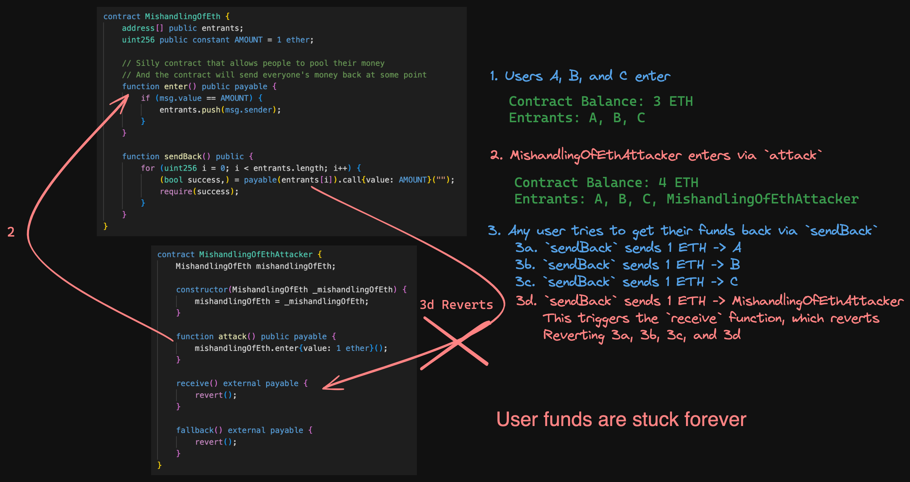

# Cyfrin - Puppy Raffle - Security and Auditing Lesson Notes

## Static Analysis

### Slither

```bash
usage: slither target [flag]

target can be:
        - file.sol // a Solidity file
        - project_directory // a project directory. See https://github.com/crytic/crytic-compile/#crytic-compile for the supported platforms
        - 0x.. // a contract on mainnet
        - NETWORK:0x.. // a contract on a different network. Supported networks: mainet,optim,goerli,sepolia,tobalaba,bsc,testnet.bsc,arbi,testnet.arbi,poly

Can also print the results out in a variety of ays using the `--print` flag and then passing in a printer name (shown in slither --help)

$ slither . --print human-summary

....

$ slither . --print contract-summary


```

slither also has native configuration for Foundry and Hardhat and we can actually just pass a single period `.` as the target and slither is smrat enouhg to figure out the framework we are using.
```
slither .

```

### Aderyin

Aderyin is a Rust based static analysis tool.

After installing everything, you can just run the command `aderyin` and it will print out a report in a folder that it details.

## Cyfrin's - Smart Contract Exploits - Minimised

[Cyfrin's - Smart Contract Exploits - Minimised](https://github.com/Cyfrin/sc-exploits-minimized) is a repository containing minimised examples of common exploits in smart contracts - such as DoS, reeantrancy, etc.

It includes links to various sites where the can be tested, visualised, and even found in CTF challenges.

## Denial of Service - DoS

Denial of Service attacks can be fairly straight forward conceptually, but are quite powerful. There are a few DoS attack types that are used.


### Quick Attacker Mindset Questions for DoS Attack Vectors

- Is there a loop with a non-defined ending index or size? Think of the size as being infinite and ask `can infinite deny the operation of the protocol due to time or cost?`
- What are the upstream or downstream implications (if any) for an, imagined, infinite sized array?
- Is it possible that the smart contract could be trying to send a token to an address that can't recieve it?
- What logic problems arise when the protocol can't complete some neccessecary pieces of logic? 
  - Is there broader denial of service of the protocol?
- What external calls exist in the protocol? 3rd party, transfer of ETH
  - Is there a way for these external calls to fail? 
  - Can attacker malciously revert instantly on recieve or fallback to cause flow on effects?
  - Is there a specified gas limit that can be xploited in external calls from the protocol to cause a revert?
  - If yes, will it casuse the tope level function to revert entirely? 
  - How doe sthis affect the system?


### Attack vectors

#### Ethereum Block Gas Limit

Ethereum block sizes are limited by setting block gas fee limits. An Ethereum block has a target size of 15 million gas and a `maximum limit of 30 million gas`

#### Gas costings DoS attack
An attacker may find a contract desinged for a lottery, DeFi protocol or some sort of financial reward and blow up the size of an array that is looped over to deny any other people interacting with this array because of the costs associated with it. Potentially exceeding the block gas limit.

We can often see DoS attacks in cases where there is looping over arrays. This scenario normally raises some eyebrows at potential gas costs, and it is corerct that this can be more gas expensive - and in fact, this is what begins to feed into the issue.

Here is a snippet of a loop from the sc-exploits-minimized repository:

```solidity

address[] entrants;


//@note this function checks to see if the msg.sender already exists in the entrants array
function enter() public {
        // Check for duplicate entrants
        for (uint256 i; i < entrants.length; i++) {
            if (entrants[i] == msg.sender) {
                revert("You've already entered!");
            }
        }
        entrants.push(msg.sender);
    }
```

In this function, we will loop through the address array `entrants` to see if the msg.sender address already exists in the array.

As the size of this array continues to grow in size, the computation cost - as well as gas costs - begin to rise. 

An easy way to think about this is if the array had 1000 addresses, to verify the msg.sender address doesn't exist in the array from 0 to 999, it would take way more gas before being pushed into the array. However, the 3rd address only has to loop 3 times and therefore the gas cost is way lower. Now imagine there is 10,000 addresses in the array!

We have created a situation where there is a possibility that this function of the protocol becomes unusable because of the gas cost to complete the checks! Essentially denying the service of the contract.

#### Denial of Smart Contract Logic DoS attack by an attacker not having expected logic to handle certain transactions

We can see this attack begin to arise when we are dealing with a protocol that attempts to carry out straigth forward logic processing but have not accounted for the contract address that is interacting with it to be misconfigured in a way that can affect other core logic functions of the protocol.

For example, if the part of a lottery or auction system picks a winner, or handles highest new highest bidder and is holding on to tokens, and attempts to transfer a token/s to required address - such as winner, or former highest bidder but that address causes a revert. We may deny the service of the rest of the protocol because the spefific fucntions is required to be completed before it can execute normal operations.

### Proof of Concept

You can write tests, using a framework like Foundry, that interacts with functions that loop over arrays and for each transaction we can capture the gas costs for each transaction and carry out an assertion that for each new item added to the array results in higher gas fees.

The sc-exploits-minimized repository contains some Foundry tests demonstrating this exact PoC.

### DoS Case Study with Owen Thurm of Guardian Audits

#### Case Study 1 - DoS Dividends from Bridges Exchage audit completed by Guardian Audits - possible to exceed block gas limit

https://github.com/GuardianAudits/Audits/tree/main/Bridges

The protocol used an unbounded array to maintain a list of addresses that would receive receive shares of dividend payments for holding certain tokens. The functionality of the protocol would allow an attacker to keep generating new addresses and purchasing/minting small amount of these dividend yielding tokens and keep on repeating this until the gas cost exceeded the block gas limit, preventing any dividends.

There were no real restrictions on an attacker being able to carry out this attack. The only check the protocol had in place was to check whether or not that address had already minted more than 0 tokens or not - and this can be easily engineered to bypass by making new addresses quickly. Plus, the protocol did not have any restrictions on amont to mint and therefore an attacker could cheaply mint a large number of tokens before the gas cost exceeded the block gas limit and denying any other dividends.

**Mitigiation**

Re-desing of how you manage holders and carry out these checks. Guardian audits, for this protocol, reccomended a couple of approaches:


>Process the users in smaller batches, set a cap on number of users who can receive dividends, or modify the dividend allocation logic entirely such that a for loop is not needed.
>
>For an alternative approach, see this “pointsPerShare” implementation:
https://github.com/indexed-finance/dividends/tree/master/contracts

#### Case Study 2 - DoS because addresses that can't accept certain tokens cannot be liquidated or ADL orders in GMX

In the GMX protocol, they has a boolean variable called `shouldUnwrapNativeToken` that is used in a transfer function to transfer native tokens out of the protocol to a receiver address if the token that the addresses position has is wrapped native token - e.g wrapped ETH.

The protocol essentially tries to get the locked ETH for the wrapped ETH and then transfers the native ETH to the receiver using `payable(receiver).call{ value: amount, gas: gasLimit }("")`.

If the address is a smart contract and has a standardised `receive()` or `fallback()` function, then there is no issues and the protocol acts as expected and important time sensitive things such as liquidations can occur. However, if the smart contract at the address cannot accept the native token or **the smart contract's `receive()` or `fallback()` functions force a high gas cost to complete (perhaps some arbitrary looping?) and exceed the gas limit set causing a revert**, then the protocol will not be able to liquidate or ADL orders, and we need to always have a way of liquidating. The result of this set up is **denying the service of the protocol because liquidations cannot occur and this impacts the safety of the protocol**.

**Mitigation**

Guardian Audits proposed a couple of mitigation strategies: 

1. First approach is setting the `shouldUnwrapNativeToken` variable to `false` so that the protocol transfers the ERC20 wrapped native token to the address, removing the potential of having a smart contract as a position holder that can't accept native token transfers and therefore reverting.
2. Attempt to complete the transfer but if transfer failed, don't revert yet, instead re-wrap thge token and then transfer the tokens to the address.

## Reentrancy

Reentrancy attacks are when a function is called and due to some external call the protocol tries to make, an attacker can re-enter into the same function - or call some other functions or read some state, and then re-enter into that function.

https://github.com/pcaversaccio/reentrancy-attacks -> This repository contains a list of reentrancy attacks and different types of reentrancy attacks that have occurred.

The situation tends to arise when the CEI (checks, Effects on self, Interactions with other contracts) design principles are not followed.

The easiest scenario to understand reentrancy is when a smart contract attempts to transfer the amount of ETH the user has deposited to the contract back to the user in a withdraw-like function and the address it tries to send the ETH to is a smart contract that has been maliciously designed so that upon receiving ETH it immediately calls the withdraw function again because the protocol has not had a chance to update the balance to zero for that address yet.


Some reentrancy attacks may use the receive function to call other functions prior to reentering into the original function if that can lead to a gaining of advantage for an attacker.

### Reentrancy Attack Vectors

**Direct External Calls:** Smart contracts often interact with other contracts or external entities through external function calls. An attacker can create a contract with a fallback function that calls back into the vulnerable contract before the initial function call completes. This can lead to unexpected behavior, allowing the attacker to manipulate the vulnerable contract's state.

**Fallback/Receive Function:** Solidity contracts include fallback and/or receive function that is invoked when a contract receives Ether without any data or when a function call fails. If this fallback and/or recieve function involves interaction with external contracts before completing its execution, it can be exploited by attackers to create reentrancy vulnerabilities.

**Cross-Function Reentrancy:** Even within a single contract, reentrancy vulnerabilities can arise if multiple functions within the contract interact with each other and external contracts in such a way that the state is not properly managed between function calls. This can create opportunities for an attacker to repeatedly call functions before previous calls are fully processed.

**External Calls Within Loops:** Loops in smart contracts can be particularly vulnerable to reentrancy attacks if they contain external calls. If the loop is not properly controlled or if the state changes as a result of an external call within the loop, an attacker may be able to repeatedly invoke the loop, exploiting the vulnerable state of the contract

### Quick Attacker Mindset Questions for Reentrancy Attack Vectors

- What external calls is the contract making?
- Is the contract relying on use of another function to calculate something in this function? Can I call that function prior to finishing this one to break the expected values this function needs?
- What interval of value amounts can I use to steal funds without causing a revert?
- Can I call a known function that this target function uses in order to manipualte something in this function?
- Can I trigger a broader system event by receiving something and immediately calling an unprotected external function before this completes?
- The mroe complex a system, the harder it will be for them to control and prevent reentrancy attacks - have they missed something in the complexity?

## Weak Randomness

The blockchain is deterministic in nature and therefore, using anything on the blockchain for randomess is inherently flawed. Miner nodes influencing things through to getting the 'random' value in the same block causing an easy way of using that number, there are many weird and strange ways using the blockchain for randomness can result in something that is not random, which can jeopardise entire protocols.


### Weak Randomness Mitigation

Getting a random number off-chain using a decentralised Oracle (VRF) like Chainlink VRF, or using a Commit Reveal Scheme.

Chainlink VRF features cryptographic proof of work that it is a random number that has been generated and their docs are [here](https://docs.chain.link/vrf) are an awesome resource and can get you up and running quickly.

### Weak Randomness Case Study - Meebits NFT with Andy Li (Aussie) from Sigma Prime

- Meebits NFT created by team beind CryptoPunks
- Premise was that anybody who owned a CryptoPunks NFT was able to mint a free Meebits NFT
- Attributes of each NFT were meant to be random and certain traits were more valuable than others
- Hacker exploied the Meebits smart contract in May 2021 by 're-rolling their randomness'
- This resulted in the hacker minting a rare NFT which they sold for 700K

#### How the attack happened

1. Metadata Disclosure
   1. Attacker was able to access the metadata of traits which showed which traits were more rare and valuable than others
   2. The smart contract disclosed a link to IPFS hash that contained the meebits metadata on line 129 of the smart contract. 
   3. The JSON inside of the metadata detailed what aspects of the NFT are the most rare - pointing out the order of most rare traits to least rare traits
   4. More information about rarity could be found on the Meebits website using the `tokenURI` function where you just needed to put in your token ID and the URL would tell you about the rarity of that tokenID
   5. This meant you could check the rarity of any NFT in the collection based upon a tokenID
2. Insecure Randomness
   1. Smart contract generated weak randonmness that allowed the attacker to reroll their mint until the one they wanted to recieve
   2. The `mintWithPunkOrGlyph` function was external and took in a `uint` number that represented tokenId of a CryptoPunk or Glyph NFT and would return a `uint` value. It would check to see if you were the owner of that NFT with that tokenID
   3. After passing the checks, it then called an internal `_mint` function using that `uint` value (which will also return a `uint`)
   4. The `uint` number to be returned was named `id` and was generated by calling the `randomIndex()` function
   5. It would then assign the NFT with that ID to the address of the minter (owner of a CryptoPunk or Glyph NFT)
3. Attacker repeatedly Reroll the Mint
   1. The attacker deployed a smart contract that would repeatedly call the `mintWithPunkOrGlyph` function until they received the ID they wanted
   2. The contract had an assert statement that would check if the ID they wanted was the ID they received and if it was not, it would revert the transaction
   3. The smart contract would then try again, and again and again
4. Received rare NFT
   1. After 6 hours of repeated calls later, and thousand and thousands worth of dollars on Gas
   2. Rare meebit #16647 was minted which was the second most rare trait in the NFT collection


## Integer Overflow

We are able to specify the size of integers we use for variables - e.g uint256, uint64, int8, int128.

The number indicates the number of bits long the number can be. We can calculate the max number it can hold by using $2^{num}$ - 1$. For example, uint8 can hold up to 255, uint256 can hold up to 2^256 - 1 which is a very very large number!

If we were using a uint8 variable and we had the number `255` stored in it and it was `unchecked`, or existed in version of solidity prior to Version ^0.8.0, and we did a simple `+1` then the unit8 variable would become `0`

Version ^0.8.0 and later of solidity will simply revert if the value or calculation will break the restricted size specified.

### Integer Overflow Mitigation

For versions of solidity prior to ^0.8.0, we can use the `SafeMath` library by Open Zeppelin which has checks in place to prevent integer overflow and underflow issues.

Use newer version of solidity, upwards of ^0.8.0 which nativeyl has checks for overflowsz and underflows and will cause a revert if an overflow or underflow occurs.

If using a smaller restricted number of bits, size - increase the the number of bits! instead of uint64 use uint256.

## Unsafe Casting from Type to Type

When we cast from different types, theres a risk of causing an unrealiable number due to how the type conversion is carried out and the difference in size of number variables (in bits).

For example, the max number of uint256 is very very large, while the number that can be stored in uint64 is significantally smaller. When we type convert from a bigger number to a smaller number, we can cause: wrapping around of the number like an overflow, significant precision loss, all kinds of issues. This is becuase it is trying to use the last X number of bits of the larger number when trying to convert it.

```bash
        -->> type(uint64).max
        Type: uint64
        -- Hex: 0xffffffffffffffff
        -- Hex (full word): 0x000000000000000000000000000000000000000000000000ffffffffffffffff
        --- Decimal: 18446744073709551615
        -->> uint64 my64Uint = type(uint64).max
        -->> my64Uint
        Type: uint64
        -- Hex: 0xffffffffffffffff
        -- Hex (full word): 0x000000000000000000000000000000000000000000000000ffffffffffffffff
        --- Decimal: 18446744073709551615
        -->> uint256 twentyEth = 20e18
        -->> twentyEth
        Type: uint256
        -- Hex: 0x000000000000000000000000000000000000000000000001158e460913d00000
        -- Hex (full word): 0x000000000000000000000000000000000000000000000001158e460913d00000
        --- Decimal: 20000000000000000000
        -->> my64Uint = uint64(twentyEth)
        Type: uint64
        -- Hex: 0x158e460913d00000
        -- Hex (full word): 0x000000000000000000000000000000000000000000000000158e460913d00000
@=>     --- Decimal: 1553255926290448384
        
```

## Mishandling of ETH

This is a very broad area and there are many scenarios that can catch you out that you need to be aware of.

For example, if a smart contraact has payable functions, but does not have receive() or fallback() functions, then the smart contract must be able to very accurately track the amount of ETH sent to it through those functions for different purposes. Failure to do this can result in loss of ETH, weird scenarios that prevent functionality, incorrect paymount amounts, even causing a contract to become vulnerbale to malicious selfdestruct!

### The Selfdestrcut function and its Quirks

The EVM `selfdestruct()` function is a special function that can exist in a smart contract and when that smart contract calls the `selfdestruct()` function, it will cause the contract to be destroyed - however, when doing this it is able to send ETH to any address that is passed in as a paramter, regardless of whether or not the contract is payable.

```solidity

selfdestruct(payable(address(target)));

```
If a protocol uses variables to track the total amount of ETH and needs to do exact matching to the balance of the contract for certain functionality to occur, there is immediate concerns arising if there is no way to restore equalibirum of the two if a malicious attack occurs.

For example, if the protocol only has payable functions and a tracking variable, and this tracking variable needs to equal the remaining ETH balance to execute functions or else it can't operate correctly, possibly even breaking the protocol. An attacker could use the `selfdestruct()` function to send ETH to the protocol to deliberately cause a mismatch between the ETH balance of the contract and the tracking variable. Rendering the function that requires exact amount tracking unable to execute, locking in ETH and possibly breaking the protocol and causing a denial of service.

```solidity
// SPDX-License-Identifier: MIT

// @notice - TheUser1935 - I took this from the sc-exploits-minimized repo of Cyfrin: https://github.com/Cyfrin/sc-exploits-minimized/tree/main?tab=readme-ov-file

pragma solidity 0.8.20;

contract SelfDestructMe {
    uint256 public totalDeposits;
    mapping(address => uint256) public deposits;

    function deposit() external payable {
        deposits[msg.sender] += msg.value;
        totalDeposits += msg.value;
    }

    function withdraw() external {
        assert(address(this).balance == totalDeposits); // bad
        uint256 amount = deposits[msg.sender];
        totalDeposits -= amount;
        deposits[msg.sender] = 0;

        payable(msg.sender).transfer(amount);
    }
}

contract AttackSelfDestructMe {
    SelfDestructMe target;

    constructor(SelfDestructMe _target) payable {
        target = _target;
    }

    function attack() external payable {
        // Force the sending of ETH to target address to break the assert in withdraw function of SelfDestructMe
        selfdestruct(payable(address(target))); 
    }
}
```

### The Pull over Push for payments problem that can arise with mishandling of ETH

To open the discussion I want to include 2 quotes from [makoto_inoue's article - A SmartContract best practice: Push, Pull, or Give?](https://medium.com/noblocknoparty/a-smartcontract-best-practice-push-pull-or-give-b2e8428e032a)

> *Every Ether transfer implies potential code execution. The receiving address can implement a fallback function that can throw an error. Thus, we should never trust that a send call will execute without error. A solution: our contracts should favor pull over push for payments.*

> *External calls can fail accidentally or deliberately. To minimize the damage caused by such failures, it is often better to isolate each external call into its own transaction that can be initiated by the recipient of the call. This is especially relevant for payments, where it is better to let users withdraw funds rather than push funds to them automatically. (This also reduces the chance of problems with the gas limit.) Avoid combining multiple send() calls in a single transaction*


**What does this mean?**

Well, lets imagine that we had a smart contract that took payments of ETH in and we stored ALL the addresses of the users who sent ETH to us in an array so that we could execute some logic or functionality, and at the end of carrying out what we needed to do we can sedn back everyone's ETH that they sent.

**How do we do this?**

Well, the most logical and straightforward answer is that we can loop through the array of each address and then simply use the `call{value: XX}("")` function to send ETH to the address. This is what we call the `push` method of payment - we are pushing the payment to the address.

**What's wwong with that?**

Well, as we have covered off on in previous sections, if the address that deposited some ETH and is being sent ETH back is a smart contract then there is risk of unexpected code execution.

We covered off on how we can carry out reentrancy by designing a malicious `receive()` or `fallback()` function by calling the same function or another function upon recieivng ETH.

But there is also another problem that can arise with this, beyond calling another function - *simply reverting*

**The Push method Exploit - reverting**

If we are looping through an array of addresses to **push** payments to and we encounter an address of a smart contract that immediately reverts because it can't accept payments, or its had the `receive()` or `fallback()` designed to immediately revert upon receiving ETH - *we will revert the ENTIRE transaction of the function that was sending ETH back to people.*

The attacker can cause ALL ETH of the contract to be locked with no way of users being able to get their payments!



**So what is the pull method?**

The pull method is to move away from attempting to push payments to users, and instead design the protocol in such a way that users can `pull` the payment from the smart contract to themselves in their own time.

It is important to still remember the quotes from the beginning of this section though, and the snippet "*Every Ether transfer implies potential code execution*" is something that should be a pinned thought that lingers in the back of your mind, changing how you think forever about payments. This is because we can't just forget about other vulnerabilities that can arise with payments - ensure that we use the Checks, Effects, Interactions (CEI) approach in functions and nonreentrant logic to ensure that malicious users can't manipulate another area after we fix this one. 

### Mishandling of Eth Case Study - SushiSwap

For this case study, we look at the article [samczun - Two Rights Might Make A Wrong](https://samczsun.com/two-rights-might-make-a-wrong/) where samczun found a vulnerability in the SushiSwap MISO platform that jeopardised ~350 million USD worth of ETH at the time. It is a really intersting and unique finding that can seem a littel too conceptual at the start and hard to think about, but really should be aware of because it can happen again.

The MISO platforms operates two types of auctions: Dutch auctions and batch auctions.

The protocol featured a function called `batch` which allowed multiple transactions to occur in a single transaction by looping through calldata and using the special function `delegatecall()` which we have spoken about before.

samczun found that inside the delegate call, `msg.sender` and `msg.value` were persisted. And this meant that an attacker could batch multiple calls that called other functions that used `msg.sender` as part of its logic and it would re-use the original `msg.value` amount of ETH across every transaction, allowing the attacker to bid in the active Dutch auction going on for free. Essentially an attacker could send 1 ETH and be able to make 100 calls instead of being limited by the requirement of ETH per transaction.

To really make it clear, the `msg.value` always remained constant and used in every batch call because of looping. 

The protocol would track the amount of ETH sent in by the user in the `commitEth` function, which is where the batch function with its looping really begins to shine in how bad this can get. See its one thing to allow a user to execute calls for free, but it would be a whole other issue if other user funds could be at risk.

Well, it turns out they were. smczun found some refund logic that would allow the removal of ETH from the contract. What he found was
> *... a refund would be issued for any ETH sent which went over the auction’s hard cap. This applied even once the hard cap was hit, meaning that instead of rejecting the transaction altogether, the contract would simply refund all of your ETH instead*.
>
>*Suddenly, my little vulnerability just got a lot bigger. I wasn’t dealing with a bug that would let you outbid other participants. I was looking at a 350 million dollar bug.* 

This is because of the fact that `msg.value` remained persitant and an attacker could simply recursively do batch transactions to increase the amount of perceived ETH deposited by the attacker until forcing a refund transaction to occur that would drain all of the ETH that others have deposited because it was not correctly tracked of how much they had deposited and other controls. An attacker could have spent 1 ETH to take 140,000 ETH out of the contract worth ~350 million USD at the time.

I really appreciate the reflection posted in regards to handling `msg.value`:
>*First, using msg.value in complex systems is hard. It’s a global variable that you can’t change and persists across delegate calls. If you use msg.value to check that payment was received, you absolutely cannot place that logic in a loop. As a codebase grows in complexity, it’s easy to lose track of where that happens and accidentally loop something in the wrong place. Although wrapping and unwrapping of ETH is annoying and introduces extra steps, the unified interface between WETH and other ERC20 tokens might be well worth the cost if it means avoiding something like this*


***I highly reccomend reading the article because it extends past covering the vulnerability into the disclosure and follow on actions, as well as reflections - it is very interesting***

## Floating pragma - what is it?

Floating pragma refers to using a flating version of solidity for compilation, meaning that there can be different versions used. You are much better of using a single version of solidity, rather than having the risk of different version occurring.

## Slither Static Anlysis Tips and Tricks

[Cyfrin -Security and Auditing, PuppyRaffle - video 40](https://updraft.cyfrin.io/courses/security/puppy-raffle/slither-walkthrough?lesson_format=video) contains some useful tips for working with Slither for a beginner. 

The video includes basic tips like to have Slither ignore the next line of code if its a false positive being called out or you have captured it already, excluding dependencies in analysis, how the GitHub repo can help find what detector is being used.

